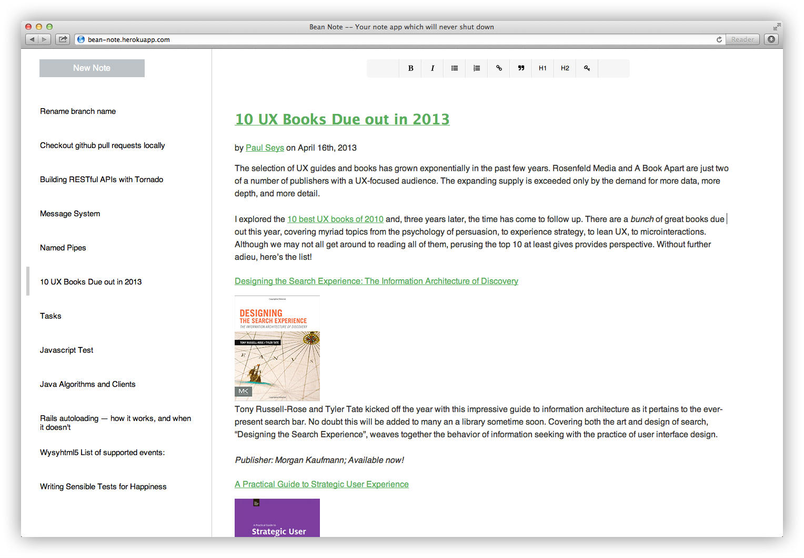

## Personal Note Service

BeanNote is an self hosted note application. Now it contains a backend RESTful service which persisting note content into mongodb,
but it really designed for adapting any persisten storage(including Dropbox).

---




## TODO
* supporting SQL storage
* supporting Dropbox sync
* supporting MarkDown format/editor
* offline access
* Chrome plugin to clip any article to bean note

## Run On Heroku
```
# cd to your repo, then create a app
$ heroku create

# add mongodb plugin
$ heroku addons:add mongolab

# push
$ git push heroku master

# the default authentication is **username: bean, password:note**
# you can change that by whatever you want using heroku config
$ heroku config:set USERNAME=mike PASSWORD=123

```

## Thanks To Awesome Projects
* [Node.js](http://nodejs.org/)
* [Express](http://expressjs.com/)
* [AngularJS](http://angularjs.org/)
* [wysihtml5](http://xing.github.io/wysihtml5/)


## Docker
```
# vagrant
vagrant up

# if the vagrant folder not mounted properly then do this:
sudo /etc/init.d/vboxadd setup
vagrant reload

# after that we can create the docker image
sudo docker build -t bean-note .

# create a data directory to persist our data
mkdir /home/vagrant/mongodb-data

# finally run the container
sudo docker run -v /home/vagrant/mongodb-data:/var/lib/mongodb -d bean-note
```
